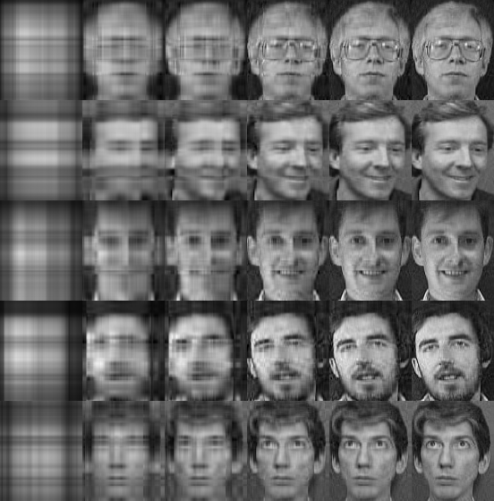
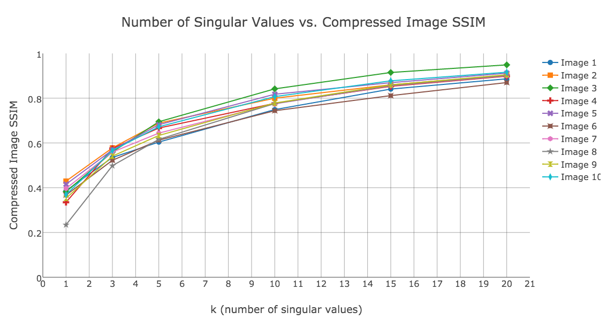
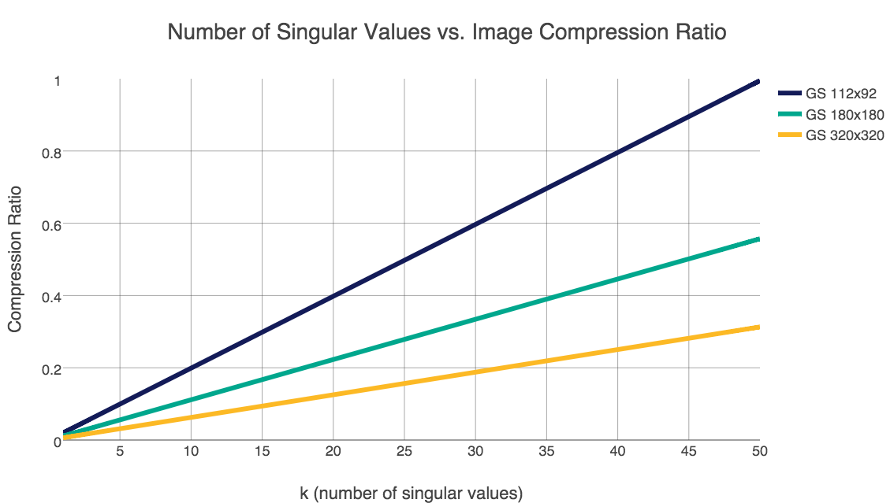
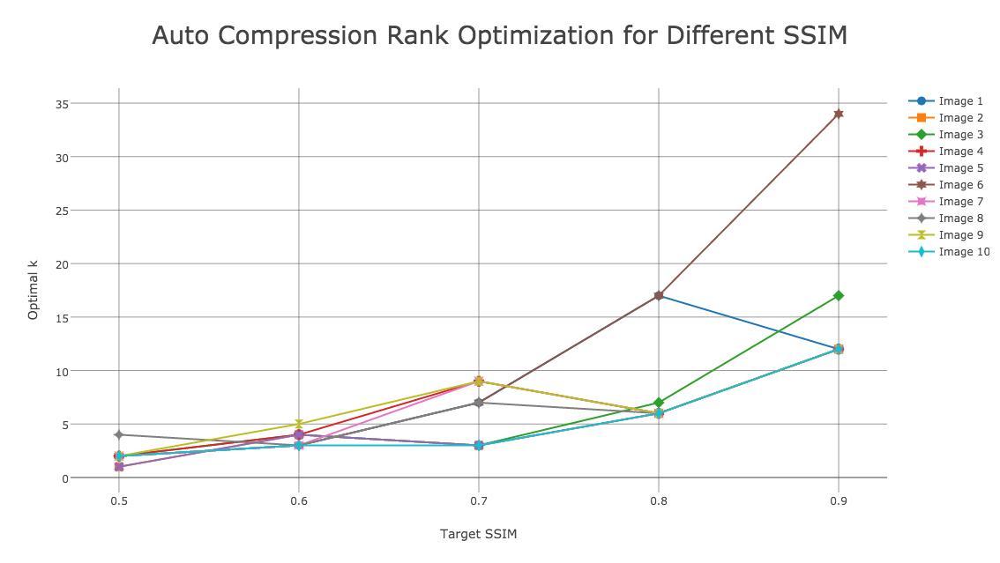

Optimal Facial Image Compression by SVD
======

### Introduction
Images are prevalent in the Internet and throughout the digital space today. While they are an excellent way to communicate information (an image is worth a thousand words), it is also an expensive form of data to be transported across the network. To solve this problem, compression software is often used to encode an image to a smaller physical size so it can be transported more efficiently while minimizing the perceptible quality change from its original copy. How much could an image be compressed before it is no longer valuable in providing information to the user? In this paper we will discuss how to optimize an image compression algorithm that is based on finding the singular value decomposition of a matrix. Due to the subjective nature of image quality examination, we also introduce an image structural similarity index to the algorithm so it could adjust the compression ratio automatically.

### Compression examples

Images at various levels of k: 5, 15, 25, 35 going from left to right, top to bottom.




### Plots







### How to run
This program depends on the following Python libraries:
* scipy
* numpy
* PIL
* skimage
* matplotlib

After dependencies are installed with pip, you can run like the following:
```
$ python image_compression.py
usage: image_compression.py [-h] [-c [COMPRESS]] [-k [K [K ...]]]
                            [-s SSIM SSIM] [-r SIZE] [-f [FNAME]]

Image compression with SVD

optional arguments:
  -h, --help      show this help message and exit
  -c [COMPRESS]   compress image using SVD
  -k [K [K ...]]  compression factor k (default 5)
  -s SSIM SSIM    calculate ssim between 2 images
  -r SIZE         image resize percentage (default 100)
  -f [FNAME]      saved compressed image to file
```

For example, to compress a gray scale image saving its top 10 singular values:
```
python image_compression.py -c myimage.png -k 10
```

For colored (RGB) images, if you don't want to use the default, make sure you enter a k value for each channel like this:
```
python image_compression.py -c myimage.png -k 10 10 10
```


